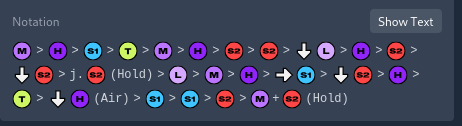
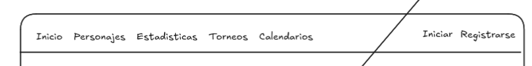
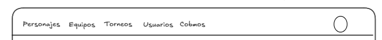
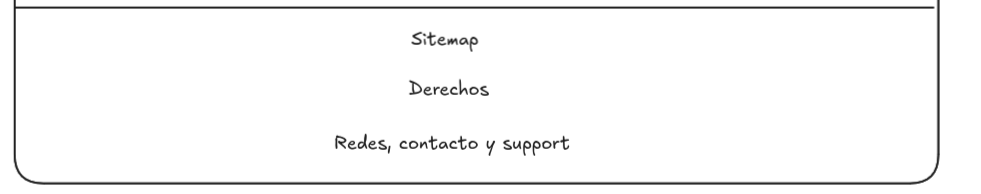
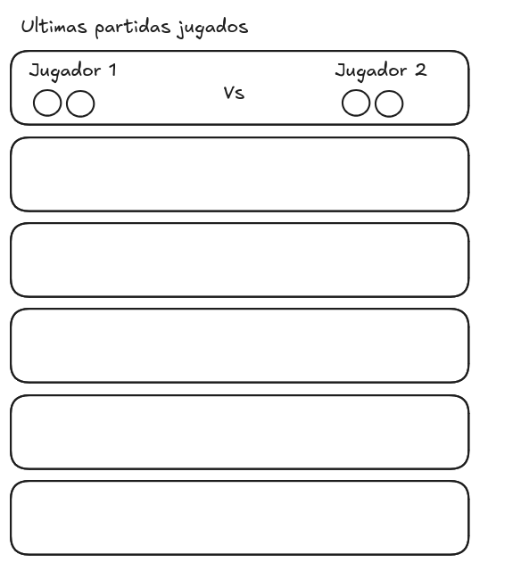
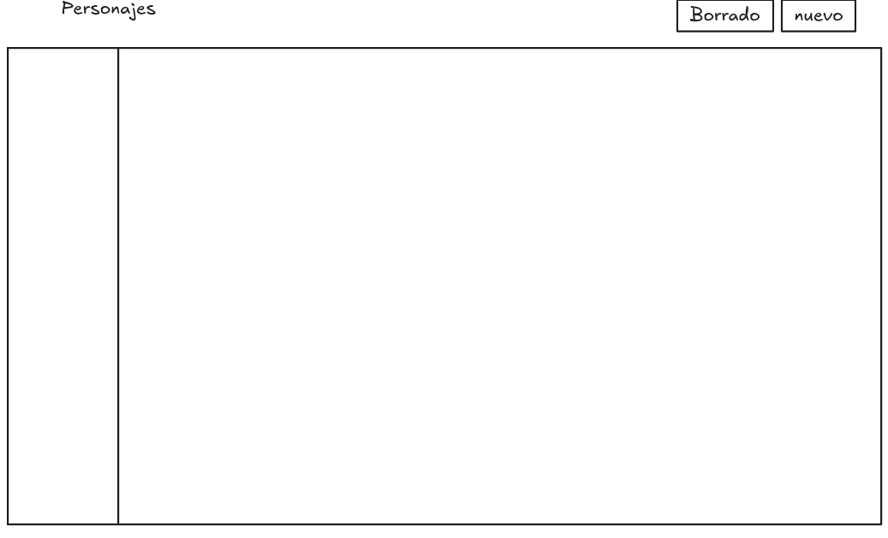
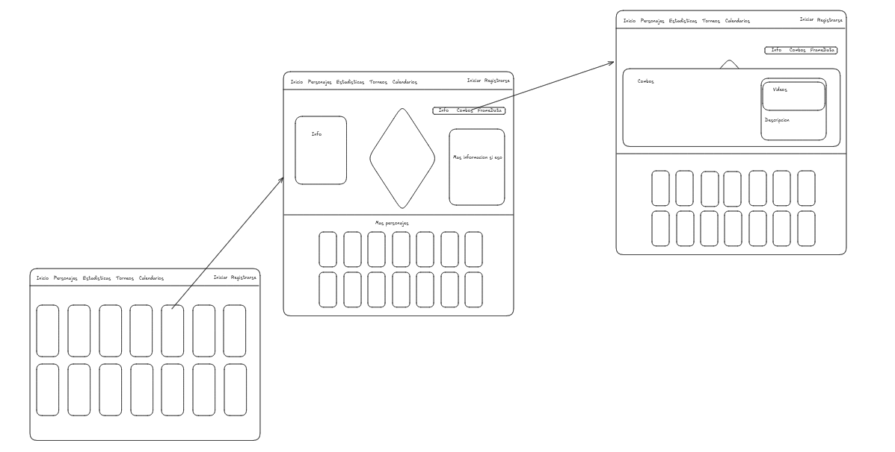

# Frontend

For the frontend development, Angular has been chosen along with Material icons.
Due to compatibility, we will use TypeScript with Angular.
If other libraries are needed, they may be used, but permission must be requested
first during the planning phase.

The application consists of a platform where users can view the official combos
of fighters from the game 2XKO, along with community tournament organization and
the ability to save, publish, and share combos. The views will be explained in
the following sections.

Use the frontend folder for development, and use `npx autoskills` to install the
necessary skills.

Store any multimedia content you can gather using a proper file architecture so
it can be used later. If you cannot obtain multimedia content, leave only the
paths and create a separate file called `pending.md` indicating all pending
operations or broken links throughout the project.

If you consider it necessary, create commits during development to save progress,
using good practices such as descriptive names (add, create, fix, etc.).

If you need information about what each user type is allowed to do, check the
files `spring-security.md` and
`/Fight_League_KO/backend/src/main/java/FightLeagueKO/security/SecurityConfig.java`.
If in doubt, ask.

As a general functionality, any displayed combo should be translatable from text
notation to images, as seen on <https://2xkombo.gg/> where we have
.

## Header

The header has four different types, two of which are very similar.

1. **Unregistered user**: A header with the fields Home, Fighters, Statistics,
   Ranking, Tournaments, and Calendar aligned to the left, and Log In and
   Register aligned to the right.

   

2. **Registered user**: Same as unregistered, except instead of Log In and
   Register, there will be a user icon which is a dropdown button with options
   to go to their profile and log out. On the left side, they will also have
   the Community Combos section.

3. **Registered organizer**: Same fields as a registered user.

4. **Admin**: The menu will have fields to access system management: Combo, User,
   Games, Teams, Tournaments, located on the left, while on the right an icon
   with the admin user image will appear.

   

## Footer

The footer will contain links to social media (Twitter, Instagram), a Contact Me
link to a template email address that will be modified later, and a Support Me
link. Before the links, a message will appear stating that no rights are held
over the products — they belong to Riot Games and this is for academic purposes
only. Add a simplified sitemap.

## Registration - Login

The views for user registration will be typical forms that satisfy the endpoints
for user creation and login. Try to style them a bit.

## User Profile

### Organizer - Registered User

The profile will show an image, the nickname, and personal statistics such as
wins/losses, as seen on
<https://2xkombo.gg/player/m80-hikari-1803850?season=season_0>, along with a
button to modify allowed parameters.

## Home

There are 3 different view types depending on the user type.

### Unregistered

The main view should have a grid of fighters ordered by creation date, with a
design similar to <https://www.streetfighter.com/6/es-es/character>, where
clicking on any fighter takes you to their character sheet. The hover highlight
effect on characters is also desired.

### Registered User

Registered users will have a list of their last played matches. If there are no
matches played, a motivational message will be shown indicating it's time to
join a tournament, along with a button leading to tournaments. Matches won by
the user will be shown with a light green background and lost ones in red. They
will be displayed using small circular images.

### Organizer

Same as registered user.

### Admin

Will display a list of the different sections available in the header to access
them.

## Fighters

The fighter view is divided into two user types.

### Admin

Will have a text indicating the current section along with a button for creating
new characters located on the right, above a table with the main fighter
attributes — only the most relevant ones such as id, name, type, slug, deleted
as columns, with each row representing a fighter. At the end of each row there
will be a series of buttons allowing edit, delete, restore, and view all
information. At the beginning of each row there will be a checkbox to delete
multiple fighters at once by sending multiple delete requests.

Creating a new character will be done through a form with the necessary fields
to satisfy the creation endpoint in
`backend/src/main/java/FightLeagueKO/fighter/controller/FighterController.java`.
Modification will do the same but will display all information and only allow
editing the necessary fields for updating.

Forms will be displayed via modal windows and submitted when the user presses
the submit button.

### Unregistered - Registered - Organizer

Will display a layout similar to
<https://www.streetfighter.com/6/es-es/character/cammy>, keeping only the
information that matches the fighter fields, such as description or likes, and
adding others like type or region. A similar distribution is desired with
information split left and right, a character image in the middle, and a
submenu above the information placed on the right.

The submenu will have two entries: one called **Info** (the main view used to
return) and another called **Official Combos** used to show the official combos
for this character. The combos submenu should have a distribution similar to
<https://www.streetfighter.com/6/es-es/character/cammy/movelist>.

When I say the main character view should have a display similar to
<https://www.streetfighter.com/6/es-es/character/cammy>, I also mean having a
mini-grid with other characters below.

## Statistics

The statistics section will be divided into 2 sections if the user is not
registered and 3 if they are.

### Admin

Same as in Fighters.

### Registered - Organizer

First it will show the user's most played characters with the best winrate (or
just one of the two), then the characters with the best winrate, and finally
the teams with the best winrate. The style should be similar to
<https://2xkombo.gg/characters>. In each case, the top 10 will be shown.

### Unregistered

Same as registered but without showing user statistics — only the two following
sections.

## Ranking

The ranking will show users with the highest number of tournament wins, allowing
clicks to view their profiles. There will be no admin ranking view. A format
similar to <https://2xkombo.gg/rankings> is desired. Add a score in the backend
for the user so that depending on their position in a tournament, they are
assigned a score from 10 to 1 based on their placement — winning a tournament
(1st place) gives 10 points, while 10th place gives 1 point; the rest receive 0.

## Calendar

The calendar view will display a calendar highlighting the current day and
showing upcoming tournaments in a calendar format, using the tournament list
sorted by date. A view similar to
<https://2xkombo.gg/tournament-calendar> is desired.

## Tournament

### Admin

Same as in Fighters.

### Other Users

The tournament view will show a column list of tournaments ordered from nearest
to farthest, as seen on <https://2xkombo.gg/tournaments>. Clicking on a
tournament will open a view where the user can see public information such as
remaining slots, when the registration period ends, its status, and most
importantly a button to join the tournament if possible. When joining a
tournament, the button changes to one that allows leaving the tournament.

If an unregistered user presses the join button, they will be taken to the
registration view. This applies to all actions they are not permitted to
perform.

For organizer users, the tournaments they organize will first be shown in a
separate section. Clicking on them will open a floating view with information
fields and the ability to perform authorized actions such as modification,
closing registrations, cancellation, etc. For all actions, see
`backend/src/main/java/FightLeagueKO/tournament/controller/TournamentController.java`.
