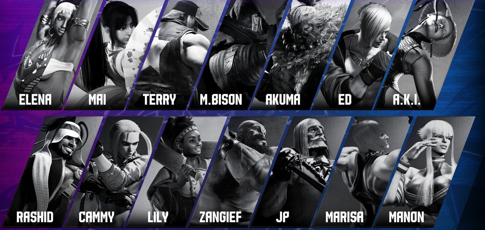
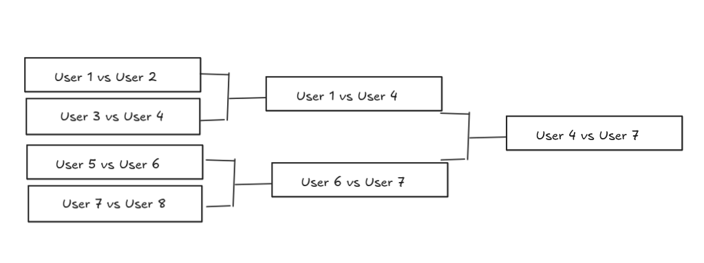
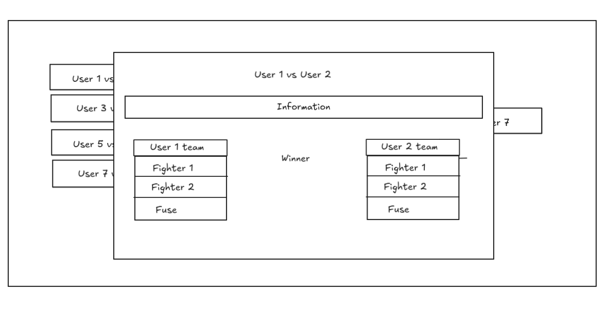

# Frontend

Frontend development uses Angular 19, Material Symbols for icons, and TypeScript across the application. If another library is needed, request approval during the planning phase before adding it.

The application is a platform where users can view official fighter combos from 2XKO, organize community tournaments, and save, publish, and share combos. The required views are described in the following sections.

> **Project context:** See `AGENTS.md` for the overall architecture and `ia/spring-security.md` for role permissions. The frontend is already scaffolded under `frontend/src/app/`, with routing, core services (`api.service.ts`, `auth.service.ts`), and shared UI such as `combo-notation.component.ts`.

Use the `frontend/` folder for development. Use `npx autoskills` to install the necessary skills.

Store multimedia content using a maintainable file structure so it can be reused later. If multimedia content cannot be obtained, leave the intended paths in the implementation and document the missing asset in the relevant task or project note requested by the user. There is no maintained root pending tracker at this time.

Create commits during development only when useful for saving coherent progress. Use concise, descriptive commit messages such as `add`, `create`, `fix`, or `refactor` followed by the affected feature.

All views must be responsive and adaptive for desktop, tablet, and mobile layouts.

## General References

- Angular documentation: <https://angular.dev/>
- Material Symbols documentation: <https://fonts.google.com/icons>
- TypeScript documentation: <https://www.typescriptlang.org/docs/>
- MDN responsive design guide: <https://developer.mozilla.org/en-US/docs/Learn/CSS/CSS_layout/Responsive_Design>
- MDN CSS Grid guide: <https://developer.mozilla.org/en-US/docs/Web/CSS/CSS_grid_layout>
- MDN Flexbox guide: <https://developer.mozilla.org/en-US/docs/Web/CSS/CSS_flexible_box_layout>
- Riot Games legal information: <https://www.riotgames.com/en/legal>
- 2XKO official site: <https://2xko.riotgames.com/>

---

## Authentication - Registration - Login

### Login Notification (any role)

When an unregistered user tries to access a restricted route or perform an operation without permission, show a notification saying "Want to log in?" with a button that navigates to the login view.

**Login form:** Include two fields: `usernameOrEmail` and `password`. Below the password field, display a link saying "Not registered yet? Try now" that navigates to the register view.

**Register form:** The form must satisfy the user creation endpoint at `POST /auth/register`. Required fields:

- `username` (String, max 50, unique)
- `email` (String, max 120, unique)
- `password` (String, BCrypt-hashed on backend)

See `backend/src/main/java/FightLeagueKO/auth/controller/AuthController.java` and `backend/src/main/java/FightLeagueKO/user/controller/UserController.java` for the full endpoint contracts and `RegisterRequest`/`LoginRequest` DTOs.

---

## Header

The header has four variants. The registered and organizer variants are intentionally similar.

1. **Unregistered user:** Show Home, Fighters, Statistics, Ranking, Tournaments, and Calendar aligned to the left. Show Log In and Register aligned to the right.

   

2. **Registered user:** Use the same layout as the unregistered header, but replace Log In and Register with a user icon dropdown containing Profile and Log Out options. Add Community Combos to the left-side navigation.

3. **Organizer:** Use the same fields as the registered user header.

4. **Admin:** Show system management entries on the left: Fighters, Combo, User, Games, Teams, and Tournaments. Show an admin user icon on the right.

   

> **Role reference:** See `ia/spring-security.md` and `backend/src/main/java/FightLeagueKO/security/SecurityConfig.java` for the exact permission model.

On tablet and mobile widths, collapse the header navigation into a hamburger/menu toggle so the links do not wrap across the screen.

---

## Footer

The footer contains links to social media (Twitter and Instagram), a Contact Me link (template email to be replaced later), and a Support Me link. Before the links, include a disclaimer stating that this project does not own rights to Riot Games products and is built only for academic purposes. Add a simplified sitemap. Keep the sitemap links visually separated from the social/support links.


---

## User Profile

### Organizer - Registered User

The profile shows a user image, nickname, and personal statistics such as wins and losses, similar to <https://2xkombo.gg/player/m80-hikari-1803850?season=season_0>. Include a button that lets the user modify the allowed profile parameters.

**Backend endpoints:** `GET /users/me` returns `UserProfileDTO`; `PATCH /users/me` updates it via `UpdateUserProfileDTO`. See `UserController.java`. The `User` model fields include `username`, `email`, `role` (`REGISTERED`/`ORGANIZER`/`ADMIN`), `score`, and `tournamentWins`.

---

## Home

The home page has three view types depending on the user role.

### Unregistered

Show a grid of fighters ordered alphabetically by fighter name, with a design inspired by <https://www.streetfighter.com/6/es-es/character>. Clicking any fighter opens the fighter detail page. The grid uses portrait assets (`assets/fighters/{slug}/{slug}_portrait.webp`) in large romboid/parallelogram cards. Use a widened responsive container shared with the home hero/message box so the grid can show six fighters per row on desktop when space allows, four on tablet, and two on mobile. Include a hover/focus highlight effect where fighters are gray by default and recover their original full color on hover or keyboard focus.

**Backend:** `GET /fighters/all-banners` returns `List<FighterBannerDTO>` with active fighters (not deleted). See `FighterController.java`.

**Frontend:** `home.component.ts` handles this view.

The home hero/community message above the grid must use the same adaptive width as the fighter grid. It should use the widened horizontal space instead of staying constrained to the default page width, while keeping a compact height and styled background treatment.

### Registered User

Show a list of the user's most recent matches. If the user has not played any matches, show a motivational message encouraging them to join a tournament, with a button that navigates to tournaments. Matches won by the user should have a light green background; lost matches should have a red background. Use small circular images for participants or fighters.

**Backend:** `GET /games/me/recent` returns `List<RecentGameDTO>`.


### Organizer

Use the same view as the registered user.

### Admin

Show a list of the different sections available in the admin header, with direct navigation to each section.

### Grid explication

In grid view each fighter must have a romboid/parallelogram shape similar to



It should have a hover effect: each fighter is grayscale by default, and when the mouse points to a fighter or the card receives keyboard focus, it recovers its original full color. The grid must always be sorted alphabetically by fighter name. Avoid fixed row heights that can make cards overlap; use responsive column sizing, card aspect ratio, and row gaps instead. The `Fighters` label must align with the left edge of the widened grid container so it does not overlap the first row.

---

## Fighters

The fighter view is divided into admin and public role groups.

### Admin

Show a section title and a Create Fighter button aligned to the right. Below them, show a table with the most relevant fighter attributes: id, name, type (archetype), slug, and deleted status. Each row represents one fighter.

At the end of each row, include buttons to edit, delete, restore, and view all information. Delete buttons use a red destructive style and must open a confirmation floating modal before calling the backend. At the beginning of each row, include a checkbox so multiple fighters can be deleted through multiple delete requests after one bulk confirmation. Each fighter should also have buttons to update its media: banner, portrait, and icon.


**Backend endpoints:**

- List: `GET /fighters`
- Create: `POST /fighters` via `CreateFighterDTO`
- Update: `PATCH /fighters/{id}` via `FighterUpdateDTO`
- Soft-delete: `PATCH /fighters/{id}/deactivate`
- Restore: `PATCH /fighters/{id}/restore`

See `backend/src/main/java/FightLeagueKO/fighter/controller/FighterController.java` for all endpoints and `Fighter.java` for the model fields (`name`, `description`, `region`, `archetype`, `title`, `slug`, `itLikes`, `itDislike`, plus stats: `health`, `range`, `power`, `vitality`, `mobility`, `easyOfUse`).

Display forms in modal windows and submit them when the user presses the submit button.

**Frontend:** `admin-fighters.component.ts` handles this view.

### Unregistered - Registered - Organizer

The public Fighters listing grid must match the unregistered home fighter grid before the user enters a fighter detail page. Use the same portrait-based romboid/parallelogram cards, widened responsive grid container, alphabetical fighter-name sorting, grayscale-to-color hover/focus behavior, and responsive column behavior.

Use a layout inspired by <https://www.streetfighter.com/6/es-es/character/cammy>. Keep only the information that matches the fighter fields, such as description, likes, and dislikes, and add other available fields such as type (archetype), title, and region. The detail layout is split into three visual zones: left-side fighter identity and description, a large centered fighter banner, and right-side tabbed information. The centered fighter banner uses the banner asset (`assets/fighters/{slug}/{slug}_banner.webp`) as a large background-style visual layer so it can be displayed prominently without pushing the side information panels. This banner layer must remain clipped inside its showcase area and include enough top and bottom spacing so it never overlaps the header or the related fighters section.

The submenu has two entries:

1. **Info:** Returns to the main fighter information view.
2. **Official Combos:** Opens a floating modal without replacing the fighter info panel. The modal is inspired by movelist/combo browser layouts: selected combo info and notation appear at the top, a wide scrollable official combo list is restricted to the left side, and the right side keeps the embedded video/player with the combo description below it. Combo labels include difficulty, damage, meter/bars, and fuse; fuse values should use the root fuse icons with a high-contrast badge. Official combo media uses `mediaUrl`, preferring YouTube embeds when possible and falling back to an external media link. Do not display the second fighter in this official combo modal.

Below the fighter detail, include a mini-grid with other fighters. This related-fighter mini-grid should keep compact card sizing, but its cards must use the same romboid/parallelogram shape and grayscale-to-color hover/focus behavior as the public Fighters and Home fighter grids.

**Backend:** `GET /fighters/{id}` returns `FighterDTO`. `GET /fighters/{fighterId}/official` returns `List<OfficialComboDTO>` (public, no auth required). See `ComboController.java`.

**Frontend:** `fighter-detail.component.ts` and `fighters-entry.component.ts` handle these views.


---

## Statistics

The statistics section has two sections for unregistered users and three sections for registered or organizer users.

### Admin

Show a read-only admin statistics dashboard using the existing ranking/stat endpoints. The backend currently exposes calculated stats, not editable stats entities, so true admin stats CRUD requires additional backend endpoints before it can be implemented.

### Registered - Organizer

1. The user's most played fighters, the user's fighters with the best win rate, or both.
2. The global fighters with the best win rate.
3. The global teams with the best win rate.

Use a style inspired by <https://2xkombo.gg/characters>. The Statistics page uses a widened responsive layout for both registered and unregistered users. For registered users, the personal statistics strip should fit on one desktop row without overflowing, including ranking points.

The global fighter section shows the top 12 fighters. On desktop, display exactly four fighter cards per row, with responsive fallbacks for tablet and mobile. Each fighter card uses the fighter portrait asset as a full-card blurred background. The ranking position and fighter name are positioned at the top of the card. Win rate is the primary highlighted metric and should be larger than the other text, using a greenish-yellow color. Also display times played, wins, and losses with readable label/counter typography.

The global team section remains a top ranking list using the team ranking endpoint. Fuse icons in team cards should use a white background for contrast.

**Backend:** `GET /fighters/ranking` returns `List<FighterStatsDTO>` (includes `winRate`). `GET /teams/ranking` returns `List<TeamStatsDTO>`.

### Unregistered

Use the same global sections as registered users, but do not show personal user statistics.

**Frontend:** `statistics.component.ts` handles this view.

---

## Ranking

The ranking page shows users with the highest number of tournament wins. Clicking a user navigates to that user's profile. There is no admin-specific ranking view. Use a format inspired by <https://2xkombo.gg/rankings>.

**Backend:** `GET /users/ranking` returns `List<UserRankingDTO>`.

**Score system:** Each `User` has a `score` field. Points are assigned according to tournament placement:

- 1st place: 10 points
- 2nd place: 9 points
- ...
- 10th place: 1 point
- 11th place and below: 0 points

This scoring is assigned on the backend when the tournament finishes.

**Frontend:** `ranking.component.ts` handles this view.

---

## Calendar

Show a calendar view that highlights the current day and displays upcoming tournaments using the tournament list sorted by date. Use a format inspired by <https://2xkombo.gg/tournament-calendar>.

**Backend:** `GET /tournaments/all-tournaments` returns `List<TournamentViewDTO>` with `startDate` and `inscriptionCloseDate` fields.

**Frontend:** `calendar.component.ts` handles this view.

---

## Tournament

### Admin

Use the same layout as Fighters: an admin table with CRUD actions. See `TournamentController.java` for the full set of admin endpoints.

All destructive tournament delete/cancel buttons use a red style and must open a confirmation floating modal before calling the backend.

**Frontend:** `admin-tournaments.component.ts` handles this view.

### Registered and Unregistered Users

Show a vertical list of tournaments ordered from nearest to farthest, as seen on <https://2xkombo.gg/tournaments>. Clicking a tournament opens a detail view with public information: remaining slots, registration end date, status (`TournamentStates` enum: `REGISTRATION`, `WAITING_START`, `IN_PROGRESS`, `FINISHED`), and a join button when joining is possible. After the user joins, the button changes to allow leaving the tournament.

If an unregistered user presses the join button, navigate them to the registration view. Apply this behavior to all actions they are not permitted to perform.

**Backend:** `GET /tournaments/all-tournaments` (public list), `GET /tournaments/{id}/view` (public detail). Join: `PATCH /tournaments/{id}/join`. Exit: `PATCH /tournaments/{id}/exit`.

**Frontend:** `tournaments.component.ts` and `tournament-detail.component.ts`.

### Registered User Creating a Tournament

A registered user can create a tournament through a prominent button. When they create a tournament:

- Their `UserRole` is upgraded to `ORGANIZER`.
- They become the tournament owner, tracked by `userOwnerId`.
- They cannot register for their own tournaments.

**Backend:** `POST /tournaments` via `CreateTournamentDTO`. See `TournamentController.java`.

### Owner (Organizer) User

For organizer users, owned tournaments appear in a separate section. Clicking one opens a floating/modal view with tournament information and authorized actions such as modification, closing registrations, and cancellation.

Cancellation is destructive: show a confirmation floating modal before sending the cancel/delete request.

**Backend:** `GET /tournaments/me/owned`, plus `PATCH /tournaments/{id}` (update), `PATCH /tournaments/{id}/close` (close registrations), `PATCH /tournaments/{id}/delete` (cancel). See `TournamentController.java`.

Inside the floating view, include a tournament bracket graph showing the tournament games. The current implementation intentionally uses a dependency-free custom CSS/layout bracket instead of an external bracket library. The graph may be incomplete, such as during the first phase when only initial matches exist, so use a default placeholder for missing slots. When the owner clicks a match slot, redirect them to an expanded page with the same graph.



In the expanded tournament match view, the owner can click a game to open a floating window with its information. Fighter and fuse fields are searchable asset dropdowns populated from the backend and root assets:

- Fighters: `GET /fighters/all-banners`
- Fuses: `FuseType` enum values (`DOUBLE_DOWN`, `FREESTYLE`, `TWO_X_ASSIST`, `JUGGERNAUT`, `SIDEKICK`)
- Fighter icons: `assets/fighters/{slug}/{slug}_icon.webp`
- Fuse icons: `assets/fuses/{FuseName}.svg`

The winner is displayed in the middle and is set by selecting one of the two users. The winner can be changed with the same winner endpoint. The backend reverses the previous team/fighter stat effects before applying the new winner.

**Backend for game management:**

- Assign teams: `PATCH /games/{gameId}/teams` via `SetTeamsDTO`
- Set winner: `PATCH /games/{gameId}/winner/{userId}`
- Update game: `PATCH /games/{gameId}` via `UpdateGameDTO`

See `backend/src/main/java/FightLeagueKO/game/service/GameService.java` and `GameController.java`.



**Frontend:** `tournament-detail.component.ts` handles bracket display.

---

## Combos (Community)

### Admin

Use the same admin table layout as Fighters. See `ComboController.java`. Delete actions use a red destructive style and must open a confirmation floating modal before calling the backend.

**Frontend:** `admin-combos.component.ts` handles this view.

### Registered User and Owner (Organizer)

This view is inspired by <https://2xkombo.gg/> but uses the search and filter endpoints from `ComboController.java`.

**Creating a combo:** By default, a new combo is created as private. Combo creation is available only from `My Combos`; the public community view is for browsing, filtering, voting, and opening combo media. The header toggle switches between public community combos and private/owned combos. In `My Combos`, users can create combos and perform allowed actions on their own combos: edit, delete, and change visibility. Delete actions use a red destructive style and must open a confirmation floating modal before calling the backend.

**Combo creation fields:**

- `title` (String, max 100)
- `textNotation` (String, the combo button notation)
- `description` (String, TEXT)
- `pointFighterId` (UUID, required - select from fighter dropdown)
- `secondFighterId` (UUID, nullable - select from fighter dropdown)
- `comboDificulty` (enum: `BEGINNER`, `INTERMEDIATE`, `ADVANCED`)
- `fuse` (enum: `DOUBLE_DOWN`, `FREESTYLE`, `TWO_X_ASSIST`, `JUGGERNAUT`, `SIDEKICK`)
- `mediaUrl` (String, URL to video/image)
- `meterCost` (int)
- `damage` (int)

The fighter and fuse fields are searchable asset dropdowns populated with predefined names and IDs matching what the backend expects. Fighter options use `assets/fighters/{slug}/{slug}_icon.webp`; fuse options use `assets/fuses/` icons.

**Filtering and pagination:** Users can apply filters as dropdown menus in the view. See `POST /combos/search` via `ComboFiltersDTO`. Community combo search uses backend pagination with a default page size of 10 combos and frontend previous/next pagination controls. Sorting options are `Latest` and `Most liked`; there is no default sort button in the UI.

**Voting:** Users can like or dislike combos. See `PATCH /combos/{comboId}/vote?voteType=LIKE|DISLIKE` and `PATCH /combos/{comboId}/unvote`.

**Media:** Community combo cards use a compact card/list layout. Each card includes a `Media` button beside the damage badge. Pressing it opens a media-only modal. YouTube URLs embed when possible; non-embeddable URLs fall back to an external `Open media` link.

**Notation rendering and validation:** Any displayed combo should be translated from text notation to control glyph images from `assets/controls/` when available. Notation blocks default to image notation and include a per-block toggle to show the original text notation. Combo create/edit forms include a `?` helper tooltip explaining accepted syntax. Strict validation accepts numpad directions `1`-`9`, attacks `L`, `M`, `H`, `T`, `S1`, `S2`, repeat counts such as `5H(2)`, air notation such as `j.M` and `j.2HH`, modifiers `air`, `jump`, `jc`, `dash`, `microdash`, `walk`, `hold`, `delay`, `delayed`, `assist`, and `cancel`, plus separators `>` for next, `+` for together, comma for pause, and `/` for alternative. The `dash` modifier renders as the forward-advance glyph at `assets/controls/Glyph-forward_forward.svg` instead of a text label. Direction word aliases, motion notation such as `236H`, and free-text move names are rejected in create/edit forms; existing invalid saved notation displays as invalid text chips instead of breaking the page.


**Frontend:** `community-combos.component.ts` handles the public list, `My Combos`, create/edit modal, media-only modal, voting, filtering, and visibility actions. `combo-notation.component.ts` handles text-to-image notation rendering. Fighter image asset paths follow `assets/fighters/{slug}/{slug}_portrait.webp`.

**Combo endpoints reference:**

| Method | Path | Auth | Purpose |
|--------|------|------|---------|
| `POST` | `/combos/search` | Authenticated | Search/filter combos |
| `POST` | `/combos` | Authenticated | Create combo |
| `PATCH` | `/combos/{id}` | Authenticated | Update combo |
| `PATCH` | `/combos/{id}/delete` | Authenticated | Soft-delete combo |
| `PATCH` | `/combos/{id}/restore` | Authenticated | Restore combo |
| `PATCH` | `/combos/{id}/public` | Authenticated | Set public |
| `PATCH` | `/combos/{id}/private` | Authenticated | Set private |
| `PATCH` | `/combos/{id}/vote` | Authenticated | Vote (LIKE/DISLIKE) |
| `PATCH` | `/combos/{id}/unvote` | Authenticated | Withdraw vote |

---

## Quick Reference: Backend API Groups

| Domain | Base Path | Public Endpoints | Authenticated | Admin Only |
|--------|-----------|------------------|---------------|------------|
| Auth | `/auth` | `register`, `login` | N/A | N/A |
| Fighter | `/fighters` | `/{id}`, `/all-banners`, `/ranking` | N/A | CRUD, stats |
| Combo | `/combos` | `/{fighterId}/official` | CRUD, search, vote, visibility | List all, get by ID |
| Team | `/teams` | `/ranking` | N/A | CRUD, stats |
| Game | `/games` | N/A | `/me/recent`, `/{gameId}/winner/{userId}` | CRUD, team assignment |
| Tournament | `/tournaments` | `/all-tournaments`, `/{id}/view`, `/{id}/bracket`, `/{id}/standings` | CRUD (owned), join/exit, close, generate | Admin list |
| User | `/users` | `/ranking` | `/me`, `/{userId}` | `/admin/**`, create |

### Key Enums

| Enum | Values |
|------|--------|
| `UserRole` | `REGISTERED`, `ORGANIZER`, `ADMIN` |
| `ComboDificulty` | `BEGINNER`, `INTERMEDIATE`, `ADVANCED` |
| `FuseType` | `DOUBLE_DOWN`, `FREESTYLE`, `TWO_X_ASSIST`, `JUGGERNAUT`, `SIDEKICK` |
| `VoteType` | `LIKE`, `DISLIKE` |
| `TournamentStates` | `REGISTRATION`, `WAITING_START`, `IN_PROGRESS`, `FINISHED` |

---

## Media

Fighter media assets are stored under the root `assets/` folder. The Angular configuration copies root `assets/` to `/assets` at build and serve time. Each fighter should have a folder named with its `slug` and three image types:

- Portrait: Used in fighter grids, including the unregistered home grid, public Fighters listing grid, and related fighter grids in fighter detail pages.
- Banner: Used as the main fighter image when a user opens fighter information.
- Icon: Used in dropdown menus, such as team insertion in a game or combo creation.

Recommended path structure:

```text
assets/fighters/{slug}/{slug}_portrait.webp
assets/fighters/{slug}/{slug}_banner.webp
assets/fighters/{slug}/{slug}_icon.webp
```

Example using Akali:

```text
assets/fighters/akali/akali_portrait.webp
assets/fighters/akali/akali_banner.webp
assets/fighters/akali/akali_icon.webp
```

If an asset is missing or cannot be obtained, keep the expected path in the implementation and document the missing file in the relevant task or project note requested by the user.

Fuse icons are also stored under the root `assets/` folder and are served through the same Angular asset pipeline. Use the naming convention from `FuseType` display names, such as `assets/fuses/Double_Down.svg`, `assets/fuses/2X_Assist.svg`, `assets/fuses/Freestyle.svg`, `assets/fuses/Juggernaut.svg`, and `assets/fuses/Sidekick.svg`.

Background images are stored under `assets/Backgrounds/` and are served through the same Angular asset pipeline. Prefer the `.webp` versions for UI backgrounds. The current visual scheme uses `Background_Green.webp` as the main app/home/combo background treatment, with `Background_Blue.webp` and `Background_Purple.webp` used selectively for tournament surfaces and modals.

### Media UI State

Admin fighter management supports create/edit/view modal workflows and media upload fields for portrait, banner, and icon assets.
